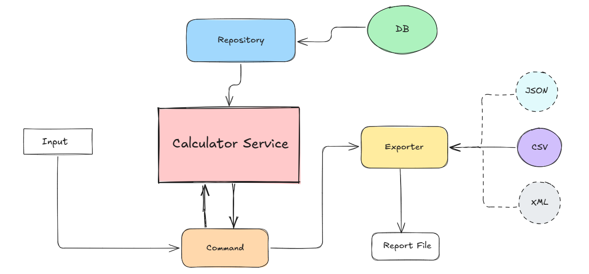

# Charger Fee Calculator
Simple EV Charger fee Calculator

## Project Overview
You can see the scenario in the following diagram.

<p></p>

- You can specify the year report in input, by default it gets the current year for calculation.

## Under the Hood
- Knowing real-world projects demand better code quality and organization. While working on it, I aimed to keep things neat and tidy, focusing on making different parts work together smoothly. To do this, I tried to use abstractions to decouple the objects.
Also, I used custom **Exceptions** to handle the errors and exceptions in a more readable way.


- Based on the knowledge of the company tech stack and leveraging the database configurations, I decided to chose Symfony framework, by using symfony we can easily scale system in the future.


- I used Symfony seeder to seed fake customer data to the database.


- For final result, I created dynamic exporter, for now we have CSV exporter, but because of the dynamic logic and factory pattern we can have different export types(e.g. json, xml) in future if needed.


- Due to time of the task, I didn't use any statically type checkers like PHPStan, Cs fixer, etc., but for real project we need to use these tools.


## Requirements
I used php fpm 8.3 with nginx in docker environment
- docker
- docker-compose

## Installation

1. get the repository
    ````bash
    git pull git@github.com:saeidtaheri/charger-fee-calculator.git
   ````
2. Change directory
    ````bash
    cd charger-fee-calculator
   ````
3. Start docker
    ````bash
    docker-compose up -d
    ````
4. Enter to the container.
   ````bash
    docker compose exec -ulms php bash
    ````
5. Copy env file
    ````bash
    cp .env.example .env
    ````
6. Change env variable to connect to the database
    ````bash
    change DB_USERNAME, DB_PASSWORD and DATABASE_URL with your credentials
    ````

7. Install Composer Dependencies
   ````bash
    composer intall
    ```` 
8. Run the migration
   ````bash
   php bin/console doctrine:migrations:migrate
    ````
9. Seed data
   ````bash
   php bin/console doctrine:fixtures:load
    ````

10. Run The App
    - if you don't specify the year, it automatically gets current year for calculation
    - Report will be generated in src/Reports directory.
    ````bash
    php bin/console report:yearly-charger-fee --file=reports/yearly_charger_fees 
    php bin/console report:yearly-charger-fee --file=reports/yearly_charger_fees --year=2025
      ````

11. Run the tests
   ````bash
   ./vendor/bin/phpunit tests --testdox
   ````